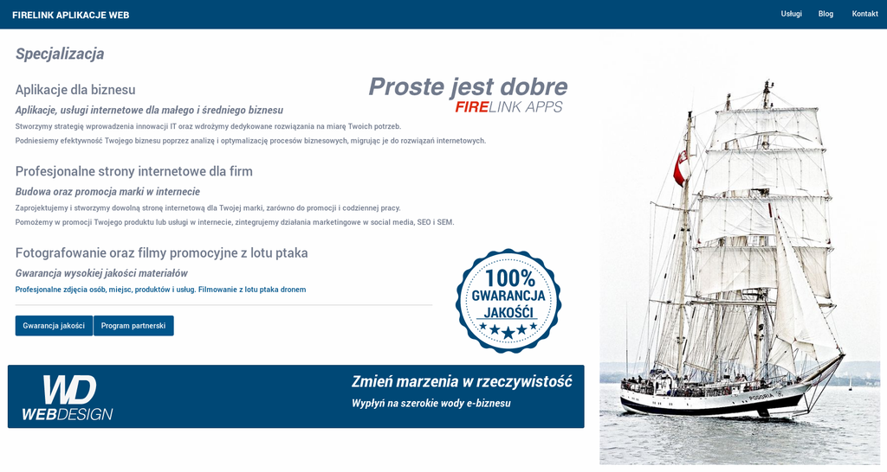
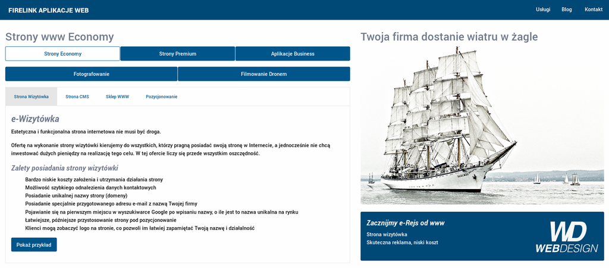
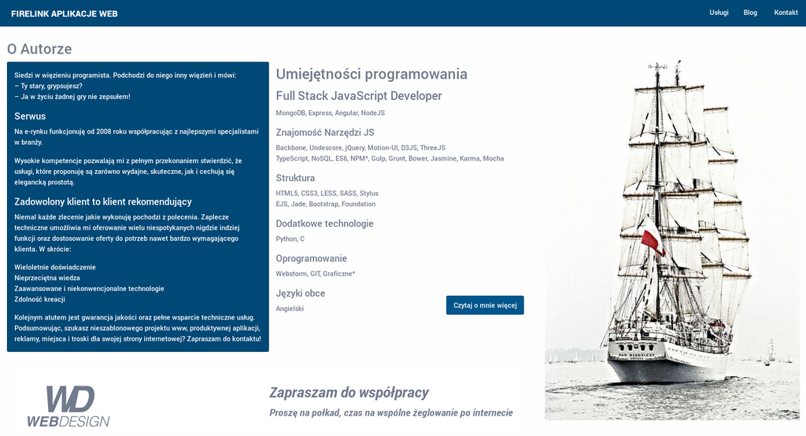
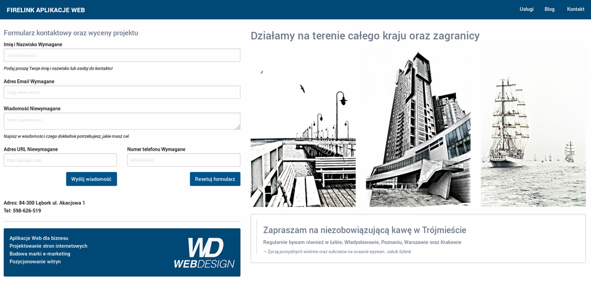

### App in NodeJS and AngularJS


Responsive and cached website at Node.js, Express with Motion UI and Stylus. A good template for building larger solutions, such as CMS, CRM entirely in JavaScript.

### Installation

**NPM (server-side)**

```nodejs
npm install
node app.js
```
We build the application via gulp. 

> Gulp is a toolkit for automating painful or time-consuming tasks in your development workflow, so you can stop messing around and build something.
>
>**Source:** [gulpjs.com](https://https://gulpjs.com/)

###### The basic commands are enough to prepare compressed js and css files:

```gulp
gulp build
```
###### You can enable the listening task
```gulp
gulp watch
```
###### or build a development version
```gulp
gulp dev
```

### Backend

- NodeJS
- Express
- Nodemailer
- Morgan
- Gulp

### Frontend

- AngularJS
- Cache Manifest
- Motion UI
- Lodash
- EJS

On the frontend side, we use AngularJS for routing and Motion UI for animation. 


> Motion UI is a Sass library for quickly creating CSS transitions and animations.
>
>**Source:** [zurb.com/playground/motion-ui](https://zurb.com/playground/motion-ui)

### User Interface

- Responsive web design (RWD) 
- CSS Foundation
- Stylus

I designed the original user interface basing on the CSS Frameworks Zurb Foundation. 

> Foundation is a family of responsive front-end frameworks that make it easy to design beautiful responsive websites, apps and emails that look amazing on any device. Foundation is semantic, readable, flexible, and completely customizable.
>
>**Source:** [foundation.zurb.com](https://foundation.zurb.com)

### Graphics

- Adobe Illustrator
- Inkscape
- HDR Photomatix

### Screenshot







